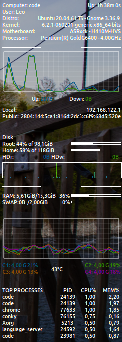

<h1 align="center">Conky Ice
	<br/>
	
	<br/>
</h1>

[](https://github.com/LeoMSSilva)
[](https://github.com/LeoMSSilva)
[](#)
[](https://github.com/LeoMSSilva/conky_ice/stargazers)
[](https://github.com/LeoMSSilva/conky_ice/network/members)
[](https://github.com/LeoMSSilva/conky_ice/graphs/contributors)

---

# :pushpin: Table of Contents

- :house: [About](#house-about)
- :dart: [Installation](#dart-installation)
  - :gear: [Install dependencies](#hammer_and_wrench-install-dependencies)
  - :rocket: [Getting started](#rocket-getting-started)
- :computer: [Techs](#computer-techs)
- :memo: [Notes](#memo-notes)
- :bust_in_silhouette: [Author](#bust_in_silhouette-author)
- :handshake: [Contributing](#handshake-contributing)
- :scroll: [License](#scroll-license)

---

# :house: About

**Conky Ice** is a **theme for Conky** that uses **Conky** and **Lua** for advanced system monitoring. It provides detailed information about the system's state, such as CPU, memory, network, disk, and temperature usage, along with dynamic graphs. The information is displayed in a customizable and configurable way, with real-time data visualization. This theme offers an attractive and functional look, ideal for users who want to monitor their system efficiently and stylishly.

## Features

- **CPU Monitoring**: Displays the individual usage of each CPU core, along with frequency and temperature.
- **Memory and Swap Monitoring**: Shows the total and used RAM and swap, with dynamic bar graphs.
- **Disk Monitoring**: Displays disk usage for the root and home partitions, along with real-time read and write graphs.
- **Network Monitoring**: Displays upload and download network traffic, along with dynamic network usage graphs.
- **CPU Temperature**: Shows the temperature of the CPU cores.
- **High Usage Processes**: Displays the heaviest processes in terms of CPU and memory usage.

## Customization

You can easily change the appearance of Conky by altering color, size, and positioning settings directly in the configuration file. Some of the options include:

- **Fonts**: The script uses the `Ubuntu` font by default. You can change it by modifying the line `xftfont ubuntu:size=8`.
- **Colors**: The script has predefined colors for various parameters. Modify the variables `color0`, `color1`, `color2`, etc., to customize.
- **Positioning**: Conky is set to appear in the top right corner by default, but you can change this by adjusting the variables `gap_x`, `gap_y`, `alignment`, etc.

---

# :dart: Installation

## :hammer_and_wrench: Install dependencies

If Conky is not installed, you can install it with the following commands:

- For **Ubuntu/Debian**:

```bash
sudo apt install conky-all inxi
```

- For **Fedora**:

```bash
sudo dnf install conky-all inxi
```

- For **Arch Linux**:

```bash
sudo pacman -S conky-all inxi
```

## :rocket: Getting Started

## How to use with Conky Manager

**Conky Manager** makes it easy to manage multiple Conky configurations without needing to edit files manually. Follow the steps below to use the **Conky Ice** theme with Conky Manager:

1. **Install Conky Manager** (if you don't have it yet):

- For **Ubuntu/Debian**:

```bash
sudo apt install conky-manager
```

- For **Fedora**:

```bash
sudo dnf install conky-manager
```

- For **Arch Linux**:

```bash
sudo pacman -S conky-manager
```

2. **Download and add the Conky Ice Theme**
Download the repository into the .conky directory in your home folder:
```bash
mkdir -p ~/.conky
cd ~/.conky
git clone https://your_conky_ice_repository.git
```
- Open **Conky Manager**.
- Check the item(s) you are interested in.

3. **Customize the configuration if necessary** (Optional)
- With Conky Manager, you can easily customize various options of Conky Ice, such as:
    - Screen position: Choose where Conky will be displayed on your desktop (top right corner, left, etc.).
    - Window size, background color, and transparency: Modify directly through the interface quickly.
    - Module selection: Enable or disable different system information that Conky displays, such as CPU, memory, disk monitoring, etc.
- For more advanced adjustments, such as fonts or graphs, you can edit the `.conky_ice` file directly.

- After customizing the theme, click Activate in Conky Manager. This will start Conky and display the system information according to the Conky Ice theme configuration.

- If you need to deactivate Conky, simply open Conky Manager, select the active item, and click Deactivate.

**Conky Manager** makes it easier to manage and customize the Conky Ice theme, simplifying the configuration and management of Conky.

---

# :computer: Techs

- **Conky**: A highly configurable system monitoring tool.
- **Inxi**: A system information utility (required to get details about the distribution and kernel).

---

## :memo: Notes

- This script is designed to work on Linux systems and may not be fully compatible with other operating systems.
- If you need help configuring Conky, refer to the official Conky documentation on the [website](https://conky.cc/) or the [repository](https://github.com/brndnmtthws/conky).

---

# :bust_in_silhouette: Author

**LeoMSSilva**

- Github: [@LeoMSSilva](https://github.com/LeoMSSilva)
- LinkedIn: [@LeoMSSilva](https://linkedin.com/in/LeoMSSilva)

---

# :handshake: Contributing

Contributions, issues and feature requests are welcome! Feel free to **file a new issue** on the [conky_ice](https://github.com/LeoMSSilva/conky_ice/issues) repository. If you already found a solution to your problem, **I would love to review your pull request**!

---

# :scroll: License

Copyright :copyright: 2025 [LeoMSSilva](https://github.com/LeoMSSilva).
<br/>
This project is [MIT](https://github.com/LeoMSSilva/conky_ice/blob/main/LICENSE) licensed.

---
